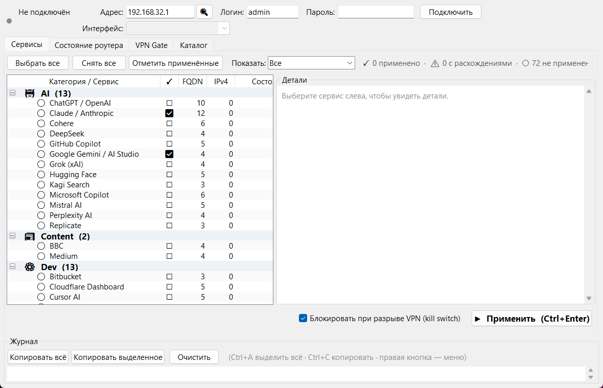
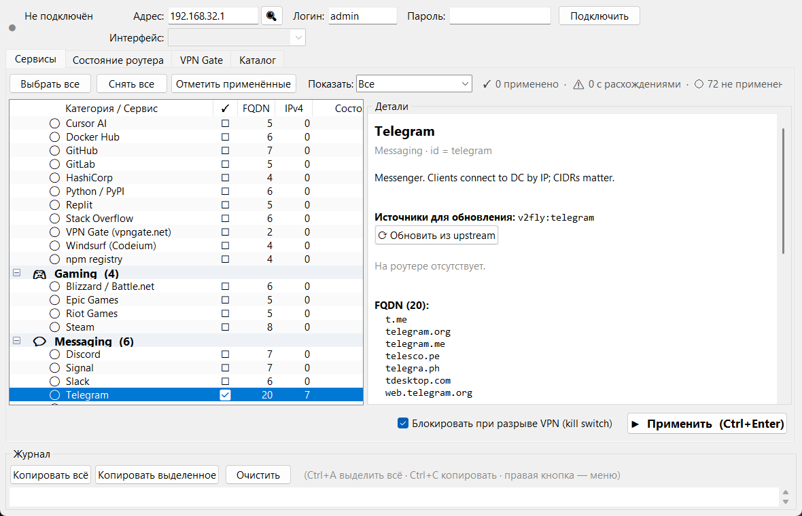
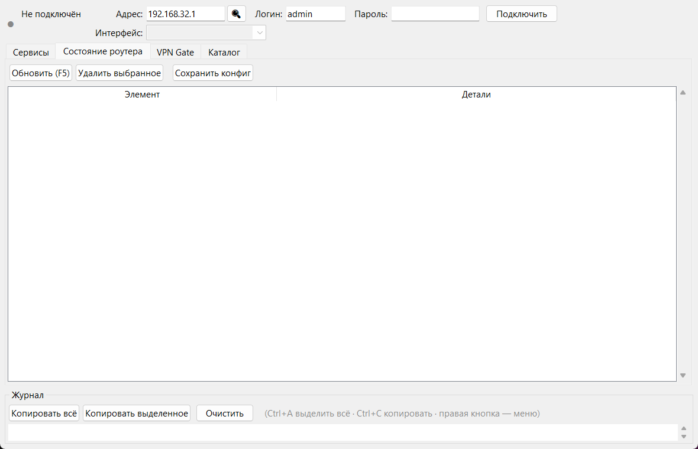
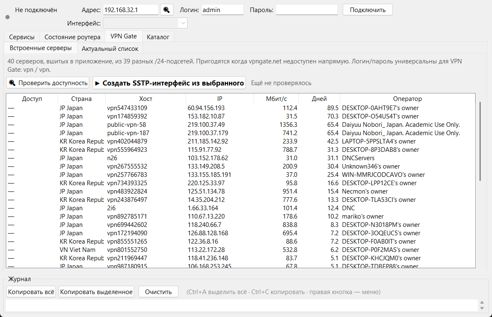
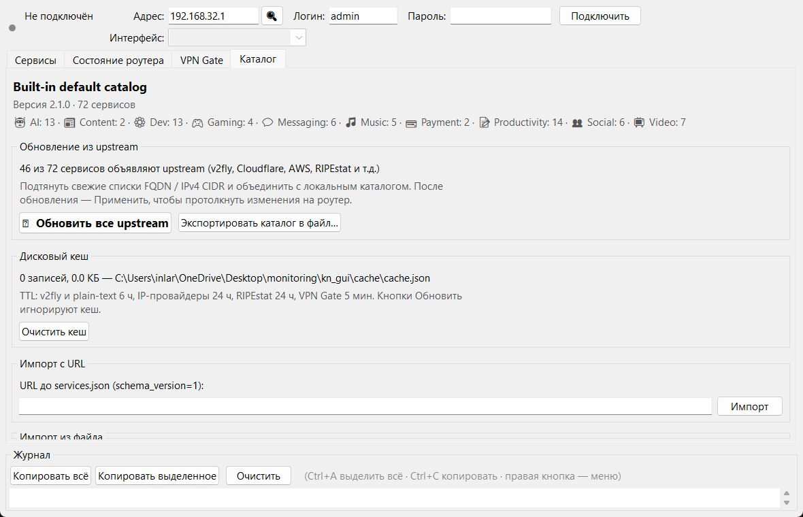

# Keenetic FQDN Manager

<p align="center">
  
</p>

<p align="center">
  <a href="https://github.com/inlarin/keenetic-fqdn-manager/releases/latest">
    
  </a>
  <a href="https://github.com/inlarin/keenetic-fqdn-manager/actions/workflows/test.yml">
    
  </a>
  <a href="https://github.com/inlarin/keenetic-fqdn-manager/releases/latest">
    
  </a>
  
</p>

Десктопное приложение для Windows, которое берёт на себя рутину настройки
**FQDN-маршрутизации** на роутерах Keenetic (и OEM-форках типа Netcraze
Hopper): создаёт `object-group fqdn`, привязывает их к VPN-интерфейсу
через `dns-proxy route`, включает **kill switch** и заботится о том,
чтобы большие списки корректно разбивались на группы по лимиту роутера.

Один `.exe` на 12 МБ, без установки и без зависимостей. Python Tkinter
внутри, весь сетевой слой — stdlib.

---

## Что умеет

<table>
<tr><td width="55%">

### Работа с сервисами
- **72 сервиса** в встроенном каталоге: AI (Claude, ChatGPT, Gemini, Grok,
  Perplexity, Cursor…), видео (YouTube, Netflix, Twitch, Vimeo),
  мессенджеры (Telegram, WhatsApp, Signal, Viber), соцсети, Dev-сервисы
  (GitHub, GitLab, Docker Hub), платёжные и т.д.
- **Авто-обновление доменов** из upstream-источников (v2fly community
  lists, Cloudflare / GitHub / Telegram / AWS CIDR-фиды).
- **Kill switch** — при падении VPN трафик не утекает через провайдера,
  а дропается.
- **Разрешение расхождений**: подсвечивает сервисы, у которых
  содержимое группы на роутере отличается от каталога, и даёт применить
  в один клик.

</td><td>



</td></tr>

<tr><td>



</td><td>

### Мониторинг состояния
- Видно **все FQDN-группы** и IP-маршруты, привязанные к выбранному
  интерфейсу, в виде дерева.
- Быстрый `F5` для обновления, удаление групп прямо из UI.
- Столбец «Состояние» показывает: `auto, kill switch` — всё защищено;
  `не привязана к маршруту` — есть проблема.
- Индикатор транспорта (**RCI HTTP** / Telnet-fallback) — видно,
  по какому протоколу идёт обмен.

</td></tr>

<tr><td width="55%">

### VPN Gate встроенный
- **40 серверов VPN Gate** в комплекте (Япония, Корея, Вьетнам,
  Таиланд) — работают даже когда сайт vpngate.net заблокирован.
- Параллельный тест доступности (TCP/443, 2с на каждый).
- Один клик — создаётся SSTP-интерфейс на роутере, логин/пароль
  `vpn/vpn` прописываются автоматически.
- Отдельная вкладка для «живого» списка с vpngate.net, фильтры по
  стране / пингу / скорости / политике логов.

</td><td>



</td></tr>

<tr><td colspan="2">

### Уведомление о новых версиях

При запуске тихо ходит в GitHub Releases API одним HTTPS-запросом. Если
на GitHub есть тег новее — показывает диалог с предложением **открыть
страницу [Releases](https://github.com/inlarin/keenetic-fqdn-manager/releases/latest)
в браузере**. Дальше пользователь скачивает `.exe` руками и заменяет
старый.

Встроенного самообновления **нет**. Было в v3.2–v3.4.5, но за этим
тянулось столько крайних случаев (AV-блокировки, UTF-8 BOM,
browser dedup `file (1).exe`, `DETACHED_PROCESS` убивающий launcher на
GUI-subsystem родителе) — что решили сдаться и оставить ручной путь.
Просто, предсказуемо, без PowerShell-магии.

</td></tr>
</table>

---

## Установка

1. Скачайте последнюю **`KeeneticFqdnManager.exe`** со
   [страницы релизов](https://github.com/inlarin/keenetic-fqdn-manager/releases/latest).
   Размер — около 12 МБ.
2. Запустите. Установка не требуется.
3. Настройки UI (последний адрес, логин, интерфейс) сохраняются в
   `%APPDATA%\KeeneticFqdnManager\ui.json`. **Пароль никогда не
   сохраняется** между сессиями.

> **Windows SmartScreen** может предупредить о «неизвестном издателе»
> — это ожидаемо для .exe без EV-сертификата. Кнопка «Подробнее» →
> «Выполнить в любом случае».

## Первый запуск

<p align="center">
  
</p>

1. **Адрес роутера** — кнопка «🔍» рядом с полем адреса автоматически
   найдёт Keenetic в локальной сети (1–3 секунды). Порядок поиска:
   предыдущий успешный адрес → шлюз(ы) по умолчанию → `/24`-скан подсети
   шлюза → типовые подсети. Всё на stdlib, без внешних зависимостей.
   Если нужно ввести вручную — обычно это `192.168.1.1`.
2. **Логин** — по умолчанию `admin`.
3. **Пароль** — тот, что стоит в веб-UI роутера.
4. Enter в поле пароля (или кнопка «Подключить»).
5. В выпадающем списке «Интерфейс» выбрать VPN-туннель
   (SSTP/Wireguard/OpenVPN/L2TP). Приложение само предложит
   активный, если такой есть.

## Горячие клавиши

| Клавиша         | Действие                     |
|-----------------|------------------------------|
| `Enter` в пароле | Подключиться                |
| `Ctrl+Enter`    | Применить выбранные сервисы |
| `F5`            | Обновить состояние с роутера |
| `Esc`           | Отключиться                  |
| `Space`         | Переключить чекбокс сервиса |
| `F1`            | Окно с горячими клавишами    |

---

## Как это работает под капотом

Приложение общается с роутером по **RCI (HTTP/JSON)** — встроенному в
NDMS 5.x REST API, к которому авторизуется через challenge-response
`SHA-256(challenge + MD5(user:realm:pass))`. Пароль никогда не летит
в открытом виде. Telnet остаётся как fallback, если веб-сервер
роутера недоступен (например, отключён компонент `http-proxy`).

Большие списки доменов автоматически разбиваются на группы размером
≤300 записей (`name`, `name_2`, `name_3`), потому что на
`object-group fqdn` у NDMS рекомендованный soft-limit именно в эту
цифру; выше начинаются лавины `Dns::Route::ResolveQueue` в логе
роутера и рост CPU на периодическом ре-резолве.

Wildcards (`*.example.com`) нормализуются в `example.com` — NDMS
делает суффикс-матчинг автоматически, литеральная звёздочка
отвергается парсером CLI.

Каталог `data/services.json` — это
[простой JSON](#формат-каталога-servicesjson), который можно
импортировать с любого URL или диска. Upstream-источники (v2fly,
Cloudflare, GitHub, Telegram CIDR) фетчатся с защитой от редиректов
на `file://` / `ftp://` и жёстким cap'ом 20 МБ на ответ, с
прозрачным fallback на `cdn.jsdelivr.net` (что полезно, когда
`raw.githubusercontent.com` заблокирован).

<p align="center">
  
</p>

---

## Формат каталога `services.json`

```json
{
  "schema_version": 1,
  "catalog_version": "2.0.0",
  "catalog_name": "My catalog",
  "services": [
    {
      "id": "service_id",
      "name": "Читаемое имя",
      "category": "AI | Video | Messaging | Social | Music | Dev | Productivity | Content | Gaming | Payment",
      "description": "Короткое описание",
      "fqdn": ["example.com", "api.example.com"],
      "ipv4_cidr": ["1.2.3.0/24"],
      "upstream": [
        {"type": "v2fly", "url": "https://raw.githubusercontent.com/v2fly/domain-list-community/master/data/example"}
      ]
    }
  ]
}
```

- `id` → имя `object-group fqdn` на роутере. Регекс: `[A-Za-z][A-Za-z0-9_]{0,31}`.
- `fqdn` — один домен на строку, **ASCII или Punycode (`xn--…`)**.
  IDN-имена автоматически переводятся в Punycode.
- `ipv4_cidr` — CIDR-форма, приложение сама переводит в `network mask`.
- `upstream` — откуда подтягивать свежие списки при клике «⟳ Обновить».

---

## Сборка из исходников

Требуется Python 3.10+ на Windows. Tkinter входит в стандартный
установщик CPython.

```batch
python -m pip install -r requirements-dev.txt
build.bat
```

## Тесты

Не-UI-слой полностью покрыт pytest (191 тест, запускаются без Tk и
без живого роутера):

```bash
python -m pytest tests/
```

CI-workflow `.github/workflows/test.yml` прогоняет тесты на каждом
push/PR на Python 3.10–3.13. Workflow `.github/workflows/release.yml`
автоматически собирает `.exe` и прикладывает к GitHub Release при
push тега `v*`, текст release notes берётся из аннотации тега.

---

## Известные ограничения

- **FQDN-маршрутизация работает, только если клиенты используют
  роутер как DNS.** Android Private DNS / iOS Encrypted DNS / браузерный
  DoH ломают механизм — роутер не видит резолв. Частично решается
  через сопутствующий скрипт `kn_block_doh.py` в корне репозитория.
- **IPv4 only.** FQDN-группы и `ip route` не транслируют AAAA-записи,
  IPv6-трафик может утекать мимо VPN. Для закрытия leak-а — утилита
  `kn_block_ipv6.py`.
- **`show log` через RCI не работает** (возвращает 404 в NDMS). Эта
  команда осталась доступной только по Telnet. Для долгосрочного
  мониторинга используйте syslog-listener из соседнего проекта.
- **Таймаут логина — 8 секунд.** При неверном пароле падает быстро.

---

## Вклад

PR-ы приветствуются. Перед отправкой — прогоните `python -m pytest
tests/` и убедитесь, что покрытие не уменьшилось. Если меняете
`services.json` — проверьте, что все новые FQDN и ID проходят
`tests/test_fqdn_validation.py`.

## Лицензия

MIT. См. [LICENSE](LICENSE).
